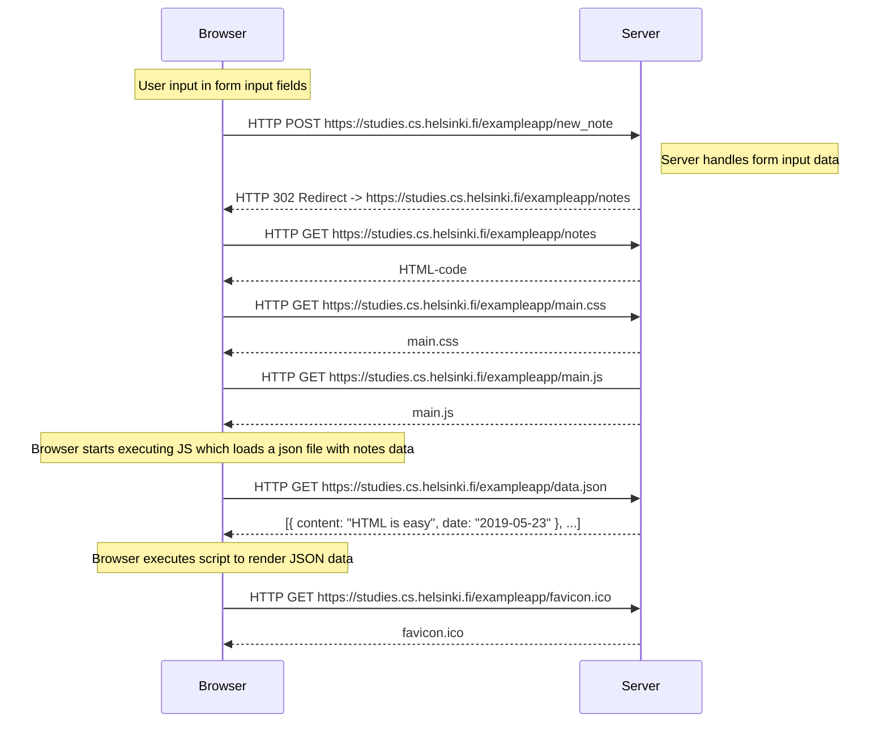

# Exercise 0.4: New post
This sequence diagram illustrates the chain of events when a user submits a new post on [the example app](https://studies.cs.helsinki.fi/exampleapp/notes)

```mermaid
sequenceDiagram

note over Browser: User input in form input fields
Browser->>Server: HTTP POST https://studies.cs.helsinki.fi/exampleapp/new_note
note right of Server: Server handles form input data
Server-->>Browser: HTTP 302 Redirect -> https://studies.cs.helsinki.fi/exampleapp/notes
Browser->>Server: HTTP GET https://studies.cs.helsinki.fi/exampleapp/notes
Server-->>Browser: HTML-code
Browser->>Server: HTTP GET https://studies.cs.helsinki.fi/exampleapp/main.css
Server-->>Browser: main.css
Browser->Server: HTTP GET https://studies.cs.helsinki.fi/exampleapp/main.js
Server-->>Browser: main.js
note over Browser: Browser starts executing JS which loads a json file with notes data
Browser->>Server: HTTP GET https://studies.cs.helsinki.fi/exampleapp/data.json
Server-->>Browser: [{ content: "HTML is easy", date: "2019-05-23" }, ...]
note over Browser: Browser executes script to render JSON data
Browser->>Server: HTTP GET https://studies.cs.helsinki.fi/exampleapp/favicon.ico
Server-->>Browser: favicon.ico

```