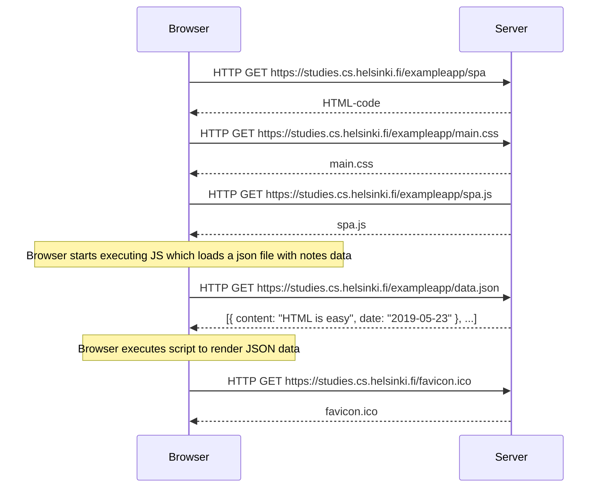

# Exercise 0.5: Single-page app
This sequence diagram illustrates the chain of events when a user loads the example [single-page app](https://studies.cs.helsinki.fi/exampleapp/spa)

```mermaid
sequenceDiagram

Browser->>Server: HTTP GET https://studies.cs.helsinki.fi/exampleapp/spa
Server-->>Browser: HTML-code
Browser->>Server: HTTP GET https://studies.cs.helsinki.fi/exampleapp/main.css
Server-->>Browser: main.css
Browser->Server: HTTP GET https://studies.cs.helsinki.fi/exampleapp/spa.js
Server-->>Browser: spa.js
note over Browser: Browser starts executing JS which loads a json file with notes data
Browser->>Server: HTTP GET https://studies.cs.helsinki.fi/exampleapp/data.json
Server-->>Browser: [{ content: "HTML is easy", date: "2019-05-23" }, ...]
note over Browser: Browser executes script to render JSON data
Browser->>Server: HTTP GET https://studies.cs.helsinki.fi/favicon.ico
Server-->>Browser: favicon.ico

```