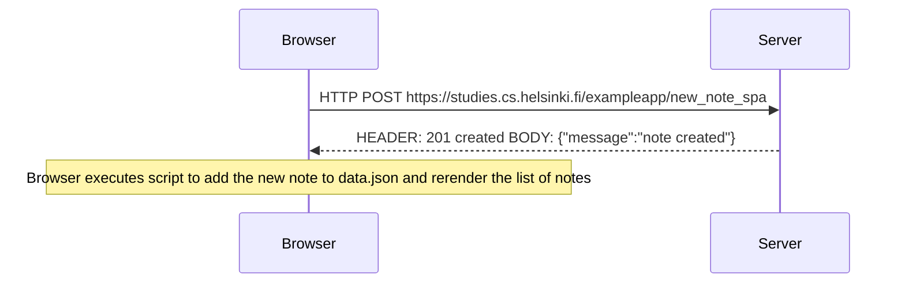

# Exercise 0.6: New note (SPA)
This sequence diagram illustrates the chain of events when a user submits a new form entry in the [single-page app](https://studies.cs.helsinki.fi/exampleapp/spa)

```mermaid
sequenceDiagram

Browser->>Server: HTTP POST https://studies.cs.helsinki.fi/exampleapp/new_note_spa
Server-->>Browser: HEADER: 201 created BODY: {"message":"note created"}
note over Browser: Browser executes script to add the new note to data.json and rerender the list of notes

```